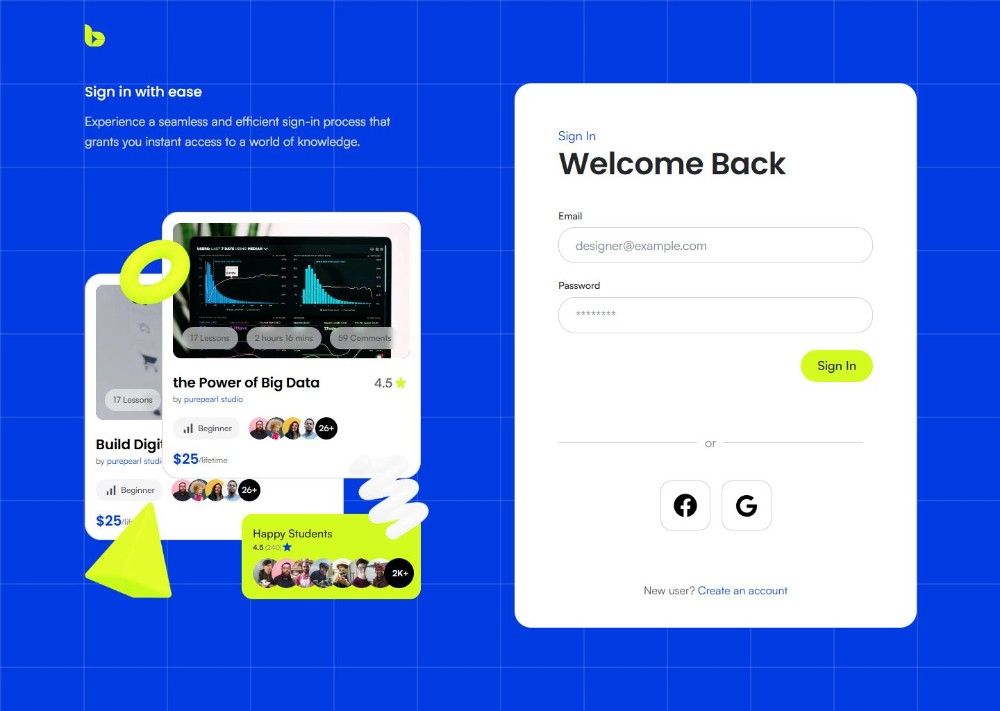
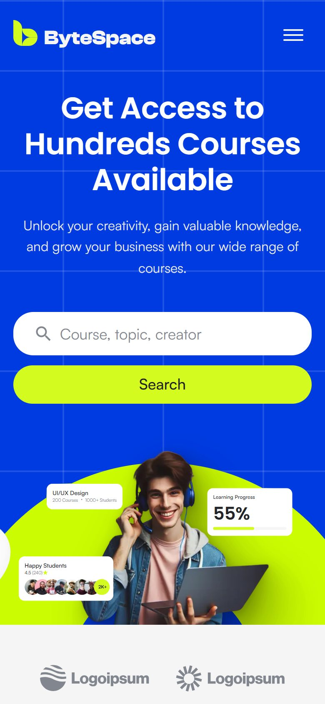
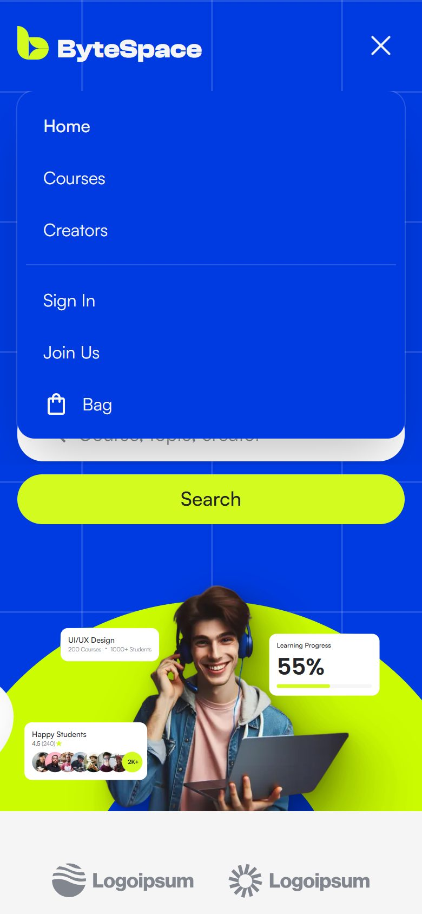

<div align="center">


# ByteSpace

**A course marketplace landing page, with sign-in and sign-up, built from a Figma design.**

[**Live demo →**](https://bytespace-phi.vercel.app) &nbsp;·&nbsp; [Pull request](https://github.com/Emon3469/bytespace-frontend/pull/1) &nbsp;·&nbsp; [Run it locally](#-getting-started)

[](https://github.com/Emon3469/bytespace-frontend/actions/workflows/ci.yml)


</div>

---

## Table of contents

- [Highlights](#-highlights)
- [Screenshots](#-screenshots)
- [Tech stack](#-tech-stack)
- [Getting started](#-getting-started)
- [Available scripts](#-available-scripts)
- [Project structure](#-project-structure)
- [Architecture & key decisions](#-architecture--key-decisions)
- [Testing](#-testing)
- [Accessibility](#-accessibility)
- [Performance & SEO](#-performance--seo)
- [Deployment](#-deployment)
- [Roadmap](#-roadmap)
- [Author](#-author)

---

## ✨ Highlights

| | |
| --- | --- |
| 🎯 **Faithful to the design** | Built against the 1440px Figma artboard; key layout coordinates are asserted in automated tests. |
| 📱 **Responsive by design** | Desktop, tablet (≤1024px) and mobile (≤768px) layouts; illustrations scale as one composition instead of breaking apart. |
| ♿ **Accessible** | Semantic landmarks, labelled forms, keyboard support, an ARIA-correct hamburger menu, reduced-motion support, and automated WCAG 2.1 checks. |
| 🔐 **Progressive-enhancement forms** | Login and Signup use Server Actions: they work without JavaScript, validate on the client *and* the server, and never leak credentials into the URL. |
| 🧩 **Reusable component system** | Design tokens from the Figma styles plus composable primitives (`Button`, `CourseCard`, `AvatarStack`, stat cards, `Ornament`…). |
| ✅ **Tested & CI-verified** | 24 unit/component tests and 91 end-to-end tests across three viewports, run by GitHub Actions on every push and pull request. |
| ⚡ **Fast** | Statically prerendered routes, optimised images, self-hosted fonts, zero layout shift. |

---

## 🖼 Screenshots

<table>
  <tr>
    <td width="62%"></td>
    <td width="19%"></td>
    <td width="19%"></td>
  </tr>
  <tr>
    <td align="center"><sub>Login (desktop)</sub></td>
    <td align="center"><sub>Landing (mobile)</sub></td>
    <td align="center"><sub>Navigation menu (mobile)</sub></td>
  </tr>
</table>

| Route | Page |
| --- | --- |
| [`/`](https://bytespace-phi.vercel.app) | Landing page: hero, partners, course catalogue with category filter, learning paths, growth & creator sections, CTA, testimonials, footer |
| [`/login`](https://bytespace-phi.vercel.app/login) | Sign in |
| [`/register`](https://bytespace-phi.vercel.app/register) | Create an account |

---

## 🛠 Tech stack

| Area | Choice | Why |
| --- | --- | --- |
| Framework | **Next.js 16** (App Router) | Server Components, static prerendering, Server Actions, built-in image and font optimisation |
| UI | **React 19** | `useActionState` for pending and error states on forms |
| Language | **TypeScript** (strict) | Typed data, props and route types |
| Styling | **Tailwind CSS v4** | Design tokens via `@theme`; desktop-first overrides with `max-lg:` / `max-md:` |
| Unit tests | **Vitest** + **Testing Library** | Fast, behaviour-focused component tests |
| E2E tests | **Playwright** + **axe-core** | Real-browser tests on three viewports plus accessibility scanning |
| Quality | ESLint · Prettier (Tailwind class sorting) | Consistent, reviewable code |
| CI/CD | GitHub Actions · Vercel | Checks on every PR; automatic preview and production deployments |

---

## 🚀 Getting started

**Prerequisites:** Node.js **22** (see [`.nvmrc`](.nvmrc)) and npm.

```bash
git clone https://github.com/Emon3469/bytespace-frontend.git
cd bytespace-frontend
npm ci
npm run dev
```

Open [http://localhost:3000](http://localhost:3000).

No environment variables are required. Optionally, set `NEXT_PUBLIC_SITE_URL` to override the canonical URL used for metadata, `robots.txt` and `sitemap.xml` (see [`.env.example`](.env.example)).

---

## 📜 Available scripts

| Command | Description |
| --- | --- |
| `npm run dev` | Start the development server |
| `npm run build` | Create a production build |
| `npm start` | Serve the production build |
| `npm run lint` | Lint with ESLint (Next.js Core Web Vitals + TypeScript rules) |
| `npm run typecheck` | Generate Next.js route types, then run `tsc --noEmit` |
| `npm run format` / `format:check` | Format or verify formatting with Prettier |
| `npm test` | Run unit and component tests (Vitest) |
| `npm run test:e2e` | Build, start and run the Playwright suite (uses the installed Google Chrome) |
| `npm run test:all` | Lint → types → unit → end-to-end |

---

## 🗂 Project structure

```text
src/
├── app/
│   ├── layout.tsx              # Root layout: fonts, metadata, viewport
│   ├── page.tsx                # Landing page (composes the home sections)
│   ├── globals.css             # Design tokens (@theme), utilities, motion
│   ├── (auth)/
│   │   ├── actions.ts          # Server Actions for sign-in / sign-up
│   │   ├── login/page.tsx
│   │   └── register/page.tsx
│   ├── robots.ts · sitemap.ts · opengraph-image.png
├── components/
│   ├── layout/                 # SiteHeader (responsive nav), SiteFooter
│   ├── home/                   # One component per landing-page section
│   ├── auth/                   # AuthLayout, AuthCard, Field, forms, collage
│   └── ui/                     # Reusable primitives
├── data/                       # Typed content: courses, categories, testimonials, links
├── lib/                        # cn(), auth validation, site URL
├── fonts/                      # Self-hosted Satoshi & Clash Display
└── __tests__/                  # Unit & component tests
e2e/                            # Playwright end-to-end tests
public/images/                  # Design assets
```

---

## 🧠 Architecture & key decisions

<details open>
<summary><b>Design tokens as the single source of truth</b></summary>

Colours (Persian Blue, Electric Lime, Shuttle Gray scale), the type scale (Heading L/M/S/XS, Body L–XS, Label XL–XS), radii and the layered drop shadow come from the Figma styles. They're declared once in `globals.css` with Tailwind's `@theme`, which turns them into utilities such as `text-heading-m`, `bg-lime` and `rounded-card`. No magic hex values are scattered through components.

</details>

<details>
<summary><b>Server-first rendering</b></summary>

Everything is a React Server Component except the three pieces that need interactivity: the header (menu state), the category filter, and the auth forms. Every route is statically prerendered, so pages are served straight from the CDN.

</details>

<details>
<summary><b>Composition-preserving responsive layout</b></summary>

The hero and feature illustrations are layered compositions (photos, stat cards and 3D shapes). Rather than reflowing them into something that no longer resembles the design, each composition is positioned on a fixed "stage" and scaled uniformly on smaller screens. Surrounding text and grids reflow normally, and positions are anchored to the horizontal centre so the design holds on ultra-wide screens too.

</details>

<details>
<summary><b>Forms that work before JavaScript loads</b></summary>

Login and Signup post to Server Actions (`src/app/(auth)/actions.ts`) through `useActionState`:

- native constraint validation in the browser, plus the same rules re-checked on the server (`src/lib/auth-validation.ts`)
- a pending state and accessible (`role="alert"`) error messaging
- progressive enhancement: submitting before hydration, or with JavaScript disabled, still works and never puts credentials in the URL

There's no backend yet. `actions.ts` is the single integration point for a real authentication API.

</details>

<details>
<summary><b>Accessible, non-shifting mobile navigation</b></summary>

At ≤1024px the links collapse into a hamburger button with `aria-expanded` and `aria-controls`. Escape closes the menu, and the panel is `inert` while hidden. The panel is an overlay revealed with a `clip-path` transition, so opening or closing it never shifts page content. In-page links use native anchors for instant scrolling.

</details>

<details>
<summary><b>Motion that respects the layout and the user</b></summary>

Entrance, float and scroll-reveal animations only use `opacity` and `translate`, so the resting layout is exactly the designed one. Scroll reveals use CSS scroll-driven animations where supported, falling back to static content elsewhere. All motion is disabled under `prefers-reduced-motion`.

</details>

<details>
<summary><b>Faithful asset treatment</b></summary>

- The decorative 3D shapes are recoloured with the same hard-light tint the design applies, then exported with transparency.
- Cut-out photos use a `filter: drop-shadow()` stack, so the shadow follows the subject's silhouette instead of its bounding box.

</details>

---

## 🧪 Testing

```bash
npm test            # unit & component
npm run test:e2e    # end-to-end on desktop, tablet and mobile
```

**Unit & component (Vitest + Testing Library) — 24 tests**
- Header: ARIA state, open/close, Escape, closing on navigation
- Category filter: single-select behaviour
- Course card: content, truncation and decorative mode
- Auth forms: constraints, pending state, server errors
- Validation rules
- Asset integrity: every referenced image exists

**End-to-end (Playwright) — 91 tests × desktop 1440 · tablet 900 · mobile 375**

| Area | What's verified |
| --- | --- |
| Page health | No console errors, failed requests or broken images; one `h1`; metadata present |
| Layout | No horizontal overflow at any viewport; key coordinates match the Figma artboard |
| Navigation | Desktop links, hamburger menu, in-page anchors, cross-page links, 404 handling, every internal link resolves |
| Forms | Validation, pending state, redirects, keyboard-only completion, and **JavaScript-disabled** submissions |
| Accessibility | axe WCAG 2.1 A/AA scan on every page; reduced-motion support |

The suite runs against a **production build**, the same artefact that's deployed, with a warm-up step so image optimisation doesn't skew results.

---

## ♿ Accessibility

- Semantic landmarks (`header`, `nav`, `main`, `footer`), a single `h1` per page, and descriptive `alt` text
- Every input has a visible label, the correct `type` and `autocomplete` hints; errors are announced with `role="alert"`
- Fully keyboard operable, with visible focus styles
- Decorative illustrations are hidden from assistive technology
- Motion is disabled for users who prefer reduced motion

> **Design note:** the design's muted grey body text (`#82868E`) has a 3.6:1 contrast ratio on white, below WCAG AA's 4.5:1. It's kept to stay faithful to the design, and is a one-token change in `globals.css` if stricter compliance is required. All other automated A/AA checks pass.

---

## ⚡ Performance & SEO

| Lighthouse (desktop) | Score |
| --- | --- |
| Performance | **97–98** |
| Best Practices | **100** |
| SEO | **100** |
| Cumulative Layout Shift | **0** |

- Every route is statically prerendered
- `next/image` serves responsive WebP; above-the-fold hero imagery loads eagerly, and the rest lazily
- Fonts are self-hosted through `next/font` (no layout shift, no third-party requests)
- Only three small client components ship interactive JavaScript
- Security headers (`X-Content-Type-Options`, `X-Frame-Options`, `Referrer-Policy`, `Permissions-Policy`)
- Open Graph image and metadata, `robots.txt` and `sitemap.xml` using the deployment's canonical URL

---

## ☁️ Deployment

Deployed on **Vercel** with the Next.js preset and Node 22. No environment variables are needed: the canonical URL is detected from Vercel's system environment.

- Every pull request gets a **preview deployment**
- Merging to `main` updates **production**: <https://bytespace-phi.vercel.app>
- [GitHub Actions](.github/workflows/ci.yml) runs lint, type-check, formatting, unit tests, the production build and the Playwright suite on every push and PR

---

## 🗺 Roadmap

- [ ] Connect the auth Server Actions to a real API with session cookies
- [ ] Course search and category filtering backed by an API (with loading, empty and error states)
- [ ] Remaining screens from the design: search, course details, lessons, reviews, creator profile, 404
- [ ] Visual-regression snapshots in CI

---

## 👤 Author

**Md Shahadat Hossain**

GitHub: [@Emon3469](https://github.com/Emon3469)

<sub>UI design provided as part of a frontend assessment. Partner logos are placeholders from the design file.</sub>
